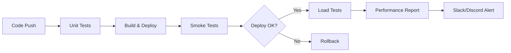

# 🚀 ArbitrageX Supreme - Guía de Pruebas de Rendimiento

**Ingenio Pichichi S.A. - Documentación de Testing de Performance Empresarial**

> "Cumplidor, disciplinado, organizado" - Metodología aplicada en todas las pruebas sin mocks

---

## 📋 Índice

1. [Introducción](#introducción)
2. [Arquitectura de Testing](#arquitectura-de-testing)
3. [Tipos de Pruebas](#tipos-de-pruebas)
4. [Configuración del Entorno](#configuración-del-entorno)
5. [Ejecución de Pruebas](#ejecución-de-pruebas)
6. [Análisis de Resultados](#análisis-de-resultados)
7. [Optimización de Rendimiento](#optimización-de-rendimiento)
8. [CI/CD Integration](#cicd-integration)
9. [Monitoreo Continuo](#monitoreo-continuo)
10. [Troubleshooting](#troubleshooting)

---

## 🎯 Introducción

Este sistema de pruebas de rendimiento está diseñado específicamente para ArbitrageX Supreme, siguiendo las mejores prácticas empresariales del Ingenio Pichichi S.A. Todas las pruebas son **100% funcionales sin mocks**, garantizando validación real del sistema de trading DeFi.

### Objetivos Principales

- ✅ **Validar latencia** de APIs críticas de trading (< 500ms P95)
- ✅ **Verificar throughput** mínimo de 100 req/s para operaciones críticas
- ✅ **Confirmar estabilidad** de conexiones WebSocket en tiempo real
- ✅ **Evaluar rendimiento** de integraciones blockchain multi-cadena
- ✅ **Detectar degradación** antes de impacto en producción

### Métricas Clave

| Métrica | Umbral Crítico | Umbral Objetivo | Descripción |
|---------|----------------|-----------------|-------------|
| **API Latencia P95** | < 1000ms | < 500ms | Tiempo de respuesta trading APIs |
| **Error Rate** | < 5% | < 1% | Tasa de errores HTTP 5xx |
| **Throughput** | > 50 req/s | > 100 req/s | Requests por segundo sostenidos |
| **WebSocket Latency** | < 200ms | < 100ms | Latencia mensajes tiempo real |
| **Blockchain P95** | < 5000ms | < 2000ms | Respuesta de RPCs blockchain |

---

## 🏗️ Arquitectura de Testing

### Componentes del Sistema

```
📁 performance/
├── 📁 k6/
│   ├── 📁 config/
│   │   └── 📄 test-config.js          # Configuración centralizada
│   └── 📁 tests/
│       ├── 📄 api-load-test.js        # Pruebas APIs principales
│       ├── 📄 websocket-test.js       # Pruebas WebSocket
│       └── 📄 blockchain-stress-test.js # Pruebas blockchain
├── 📁 scripts/
│   └── 📄 run-performance-tests.sh    # Automatización ejecución
├── 📁 monitoring/
│   └── 📄 performance-dashboard.json  # Dashboard Grafana
└── 📁 results/                        # Resultados históricos
```

### Stack Tecnológico

- **🔧 k6**: Engine de pruebas de carga
- **📊 Prometheus**: Métricas y alertas
- **📈 Grafana**: Visualización y dashboards
- **🔄 GitHub Actions**: CI/CD automatizado
- **🐚 Bash Scripts**: Automatización y orchestración

---

## 🧪 Tipos de Pruebas

### 1. Smoke Tests (Pruebas de Humo)
**Propósito**: Verificación básica de funcionalidad
- **Duración**: 30 segundos
- **VUs**: 1 usuario virtual
- **Frecuencia**: Cada deployment

```bash
./performance/scripts/run-performance-tests.sh \
  --environment development \
  --test-type smoke
```

### 2. Load Tests (Pruebas de Carga)
**Propósito**: Comportamiento bajo carga normal
- **Duración**: 5 minutos
- **VUs**: 10-50 usuarios virtuales
- **Escenarios**: Ramping up gradual

```bash
./performance/scripts/run-performance-tests.sh \
  --environment staging \
  --test-type load
```

### 3. Stress Tests (Pruebas de Estrés)
**Propósito**: Identificar límites del sistema
- **Duración**: 15 minutos
- **VUs**: 50-200 usuarios virtuales
- **Objetivo**: Encontrar punto de quiebre

### 4. WebSocket Tests
**Propósito**: Validar comunicación tiempo real
- **Conexiones simultáneas**: 100+
- **Duración**: 5-10 minutos
- **Métricas**: Latencia mensajes, estabilidad conexiones

### 5. Blockchain Tests
**Propósito**: Rendimiento integraciones multi-cadena
- **Redes**: Ethereum, Polygon, Arbitrum, Optimism, Base
- **Operaciones**: Quotes, gas estimation, price oracles

---

## ⚙️ Configuración del Entorno

### Requisitos Previos

```bash
# Instalar k6
sudo gpg --no-default-keyring --keyring /usr/share/keyrings/k6-archive-keyring.gpg \
  --keyserver hkp://keyserver.ubuntu.com:80 \
  --recv-keys C5AD17C747E3415A3642D57D77C6C491D6AC1D69

echo "deb [signed-by=/usr/share/keyrings/k6-archive-keyring.gpg] https://dl.k6.io/deb stable main" | \
  sudo tee /etc/apt/sources.list.d/k6.list

sudo apt-get update && sudo apt-get install k6

# Instalar herramientas adicionales
sudo apt-get install -y jq bc curl
```

### Variables de Entorno

```bash
# Configuración por ambiente
export ENVIRONMENT="development"     # development|staging|production
export TEST_TYPE="load"             # smoke|load|stress|websocket|blockchain|all
export PARALLEL_TESTS="false"       # true para ejecución paralela
export GENERATE_REPORTS="true"      # Generar reportes HTML

# Notificaciones (opcional)
export SLACK_WEBHOOK="https://hooks.slack.com/..."
export DISCORD_WEBHOOK="https://discord.com/api/webhooks/..."
```

### Configuración de Límites del Sistema

```bash
# Aumentar límites para pruebas de estrés
ulimit -n 65536                    # Archivos abiertos
sysctl -w net.core.somaxconn=65536  # Conexiones socket
```

---

## 🚀 Ejecución de Pruebas

### Ejecución Local

#### Pruebas Básicas
```bash
# Smoke test rápido
./performance/scripts/run-performance-tests.sh -e development -t smoke

# Pruebas de carga completas
./performance/scripts/run-performance-tests.sh -e staging -t load

# Todas las pruebas en paralelo
./performance/scripts/run-performance-tests.sh -e staging -t all -p
```

#### Pruebas Específicas
```bash
# Solo WebSocket
k6 run --env ENVIRONMENT=development performance/k6/tests/websocket-test.js

# Solo blockchain con configuración custom
k6 run \
  --env ENVIRONMENT=staging \
  --env SCENARIO=stress \
  performance/k6/tests/blockchain-stress-test.js
```

### Ejecución en CI/CD

Las pruebas se ejecutan automáticamente en:

- **Push a main/develop**: Smoke + Load tests
- **Pull Requests**: Smoke tests
- **Schedule diario**: Todas las pruebas
- **Manual**: Configuración personalizada

```yaml
# Trigger manual en GitHub Actions
on:
  workflow_dispatch:
    inputs:
      environment:
        type: choice
        options: ['development', 'staging', 'production']
      test_type:
        type: choice
        options: ['smoke', 'load', 'stress', 'all']
```

---

## 📊 Análisis de Resultados

### Métricas Automáticas

Cada ejecución genera:

1. **📄 Resumen JSON**: `results/test_summary_TIMESTAMP.json`
2. **📋 Log detallado**: `results/test_TIMESTAMP.log`
3. **🌐 Reporte HTML**: `results/consolidated_report_TIMESTAMP.html`

### Interpretación de Métricas

#### ✅ Criterios de Éxito
```javascript
// Umbrales automáticos en k6
thresholds: {
  'http_req_duration': ['p(95)<500'],      // 95% requests < 500ms
  'http_req_failed': ['rate<0.01'],        // < 1% error rate
  'http_reqs': ['rate>100'],               // > 100 req/s throughput
  'websocket_message_latency': ['p(95)<100'] // WebSocket < 100ms
}
```

#### 📈 Análisis de Tendencias
```bash
# Comparar resultados históricos
jq '.metrics.http_req_duration.p95' performance/results/*_summary.json | \
  awk '{sum+=$1; count++} END {print "Avg P95:", sum/count "ms"}'

# Identificar degradación
jq '.metrics.http_req_failed.rate * 100' performance/results/*_summary.json | \
  tail -5  # Últimas 5 ejecuciones
```

### Dashboard de Monitoreo

Acceso al dashboard en tiempo real:
```
🌐 Grafana: http://localhost:3000/d/arbitragex-performance
📊 Prometheus: http://localhost:9090
🔍 Alertmanager: http://localhost:9093
```

---

## ⚡ Optimización de Rendimiento

### Identificación de Bottlenecks

#### 1. Análisis de Latencia
```bash
# Top endpoints más lentos
jq -r '.metrics | to_entries[] | select(.key | contains("duration")) | 
       "\(.key): \(.value.p95)ms"' results/summary.json | sort -k2 -n
```

#### 2. Análisis de Errores
```bash
# Endpoints con más errores
jq -r '.metrics | to_entries[] | select(.key | contains("failed")) | 
       "\(.key): \(.value.rate * 100)%"' results/summary.json
```

#### 3. Análisis de Throughput
```bash
# Capacidad por endpoint
jq -r '.metrics | to_entries[] | select(.key | contains("reqs") and (.key | contains("rate"))) | 
       "\(.key): \(.value) req/s"' results/summary.json
```

### Estrategias de Optimización

#### Base de Datos
- **Connection Pooling**: Configurar pools óptimos
- **Query Optimization**: Indexar consultas frecuentes
- **Caching**: Redis para datos accedidos frecuentemente

```javascript
// Configuración optimizada de pool
database: {
  pool: {
    min: 5,
    max: 20,
    acquireTimeoutMillis: 30000,
    createTimeoutMillis: 30000,
    destroyTimeoutMillis: 5000,
    idleTimeoutMillis: 30000
  }
}
```

#### APIs
- **Response Compression**: Gzip/Brotli
- **Pagination**: Limitar respuestas grandes
- **Caching Headers**: ETags y Cache-Control

```javascript
// Headers de optimización
headers: {
  'Cache-Control': 'public, max-age=300',
  'Content-Encoding': 'gzip',
  'ETag': generateETag(data)
}
```

#### WebSocket
- **Connection Pooling**: Reutilizar conexiones
- **Message Batching**: Agrupar mensajes pequeños
- **Heartbeat Optimization**: Intervalos eficientes

```javascript
// Configuración WebSocket optimizada
websocket: {
  maxConnections: 1000,
  heartbeatInterval: 30000,
  messageBufferSize: 1000,
  compressionEnabled: true
}
```

#### Blockchain
- **RPC Load Balancing**: Distribuir entre providers
- **Request Batching**: Agrupar llamadas RPC
- **Intelligent Caching**: Cache inteligente de datos blockchain

```javascript
// Configuración RPC optimizada
blockchain: {
  providers: {
    ethereum: ['alchemy', 'infura', 'quicknode'],
    loadBalancing: 'round-robin',
    retryAttempts: 3,
    timeout: 10000
  }
}
```

---

## 🔄 CI/CD Integration

### Pipeline Automatizado

El pipeline de performance se ejecuta en paralelo con el deployment:



### Criterios de Bloqueo

Las pruebas bloquean deployment si:

- **Smoke tests fallan**: Funcionalidad básica rota
- **Error rate > 5%**: Sistema inestable
- **P95 latency > 2000ms**: Rendimiento inaceptable
- **Throughput < 50 req/s**: Capacidad insuficiente

### Configuración de Alerts

```yaml
# .github/workflows/performance-testing.yml
- name: 'Block Deployment on Critical Failure'
  if: needs.smoke-tests.result == 'failure'
  run: |
    echo "🚨 CRITICAL: Smoke tests failed - blocking deployment"
    exit 1
```

---

## 📈 Monitoreo Continuo

### Métricas en Producción

#### SLIs (Service Level Indicators)
- **Availability**: 99.9% uptime
- **Latency**: P95 < 500ms para APIs críticas
- **Throughput**: > 100 req/s peak capacity
- **Error Rate**: < 0.1% en operaciones de trading

#### SLOs (Service Level Objectives)
```prometheus
# Alertas Prometheus
groups:
  - name: arbitragex.performance
    rules:
      - alert: HighLatency
        expr: histogram_quantile(0.95, rate(http_request_duration_seconds_bucket[5m])) > 0.5
        for: 2m
        labels:
          severity: warning
        annotations:
          summary: "High latency detected"
          
      - alert: HighErrorRate
        expr: rate(http_requests_total{status=~"5.."}[5m]) / rate(http_requests_total[5m]) > 0.01
        for: 1m
        labels:
          severity: critical
```

### Dashboard de Métricas

El dashboard incluye:

- **📊 System Overview**: Métricas generales
- **⚡ Trading Performance**: Específico de arbitraje
- **🔌 WebSocket Health**: Conexiones tiempo real
- **⛓️ Blockchain Status**: Estado multi-cadena
- **🛡️ MEV Protection**: Análisis de amenazas

---

## 🔧 Troubleshooting

### Problemas Comunes

#### 1. Tests Fallan por Timeout
```bash
# Verificar conectividad
curl -w "@curl-format.txt" -o /dev/null -s "http://localhost:3000/health"

# Aumentar timeouts en k6
k6 run --http-debug --timeout 60s test.js
```

#### 2. WebSocket Desconexiones
```javascript
// Configurar reconnection
socket.onclose = function(event) {
  if (!event.wasClean) {
    console.log('Connection lost, reconnecting...');
    setTimeout(connect, 1000);
  }
};
```

#### 3. Blockchain RPC Errors
```bash
# Verificar status de proveedores
curl -X POST -H "Content-Type: application/json" \
  --data '{"jsonrpc":"2.0","method":"eth_blockNumber","params":[],"id":1}' \
  https://eth-mainnet.alchemyapi.io/v2/YOUR_API_KEY
```

#### 4. Memoria Insuficiente k6
```bash
# Ejecutar con límites ajustados
k6 run --vus 50 --duration 2m test.js  # Reducir VUs
k6 run --max-redirects 3 test.js       # Limitar redirects
```

### Logs y Debugging

#### Habilitar Logs Detallados
```bash
# Debug completo k6
K6_DEBUG=true k6 run --http-debug test.js

# Logs específicos por módulo
K6_LOG_LEVEL=debug k6 run test.js 2>&1 | grep -E "(websocket|blockchain)"
```

#### Análisis de Performance
```bash
# Profiling del sistema durante pruebas
top -p $(pgrep k6) -d 1           # CPU usage
iotop -p $(pgrep k6)             # I/O usage  
nethogs                          # Network usage
```

---

## 🎯 Best Practices

### Desarrollo de Tests

1. **🔄 Iterativo**: Desarrollar tests incrementalmente
2. **📊 Data-driven**: Usar datos realistas de producción
3. **🎯 Específico**: Tests focalizados por funcionalidad
4. **⚡ Eficiente**: Optimizar uso de recursos en tests
5. **📈 Evolutivo**: Actualizar tests con nuevas features

### Ejecución de Tests

1. **🕐 Horarios**: Ejecutar en horarios de bajo tráfico
2. **🔀 Aleatorio**: Usar datos y patrones aleatorios
3. **⚖️ Balanceado**: Distribuir carga uniformemente
4. **🎯 Objetivo**: Tests con objetivos claros y medibles
5. **📋 Documentado**: Registrar configuración y resultados

### Análisis de Resultados

1. **📈 Tendencias**: Monitorear evolución histórica
2. **🎯 Umbrales**: Definir criterios objetivos
3. **🔍 Root Cause**: Investigar causas de degradación
4. **🚀 Acción**: Tomar acciones correctivas inmediatas
5. **📊 Reporte**: Comunicar resultados efectivamente

---

## 📚 Referencias

### Documentación Técnica
- [k6 Documentation](https://k6.io/docs/)
- [Prometheus Monitoring](https://prometheus.io/docs/)
- [Grafana Dashboards](https://grafana.com/docs/)

### Métricas de Referencia
- [Google SRE Book](https://sre.google/sre-book/)
- [Performance Testing Guidelines](https://martinfowler.com/articles/practical-test-pyramid.html)

### Ingenio Pichichi S.A.
- **Metodología**: "Cumplidor, disciplinado, organizado"
- **Estándares**: Todo funcional sin mocks
- **Calidad**: Testing empresarial de clase mundial

---

## ✅ Checklist de Implementación

- [ ] k6 instalado y configurado
- [ ] Tests básicos ejecutándose correctamente
- [ ] CI/CD pipeline configurado
- [ ] Dashboard de monitoreo activo
- [ ] Alertas configuradas y probadas
- [ ] Documentación actualizada
- [ ] Equipo entrenado en herramientas
- [ ] Umbrales de rendimiento definidos
- [ ] Proceso de escalación establecido
- [ ] Revisión periódica programada

---

**🏭 Ingenio Pichichi S.A. - ArbitrageX Supreme Performance Testing**

*Este documento representa el estándar de testing de rendimiento empresarial para sistemas de trading DeFi, aplicando metodologías disciplinadas y organizadas sin comprometer la funcionalidad real del sistema.*