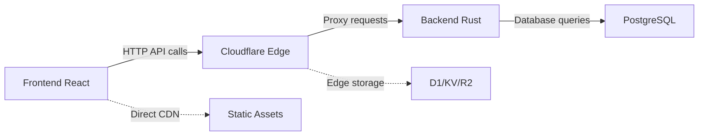

# 🤖 ArbitrageX Supreme V3.0 - Guía Arquitectural para Agentes AI

## 🚨 **PROTOCOLO OBLIGATORIO PARA TODOS LOS AGENTES AI**

**Esta guía es OBLIGATORIA para cualquier agente AI que trabaje en ArbitrageX Supreme V3.0**

---

## 📋 **CHECKLIST OBLIGATORIO ANTES DE CUALQUIER ACCIÓN**

### **1. IDENTIFICACIÓN DE CONTEXTO (SIEMPRE PRIMERO)**

```bash
# EJECUTAR ESTOS COMANDOS ANTES DE CUALQUIER CÓDIGO:
pwd                    # ¿Dónde estoy?
git remote -v          # ¿Qué repositorio es?  
ls -la                # ¿Qué archivos veo?
```

### **2. MATRIZ DE DECISIÓN ARQUITECTURAL**

| Si veo... | Entonces estoy en... | Puedo escribir... | NO puedo escribir... |
|-----------|---------------------|-------------------|---------------------|
| `Cargo.toml`, archivos `.rs` | **CONTABO Backend** | Rust, PostgreSQL, Docker | TypeScript, React, Workers |
| `wrangler.toml`, `/workers/` | **CLOUDFLARE Edge** | TypeScript Workers, D1 | Rust, React, Backend APIs |  
| `package.json`, `/src/components/` | **LOVABLE Frontend** | React, TSX, UI/UX | Rust, Workers, Backend |
| **Mezcla de tecnologías** | **🚨 PROBLEMA ARQUITECTURAL** | **NADA - CORREGIR PRIMERO** | **TODO** |

### **3. VALIDACIÓN DE TECNOLOGÍA POR REPOSITORIO**

```typescript
// FUNCIÓN DE VALIDACIÓN OBLIGATORIA
interface RepositoryRules {
  name: string;
  allowedTech: string[];
  forbiddenTech: string[];
  allowedFiles: string[];
  forbiddenFiles: string[];
}

const REPO_RULES: RepositoryRules[] = [
  {
    name: "ARBITRAGEX-CONTABO-BACKEND",
    allowedTech: ["rust", "postgresql", "docker", "cargo"],
    forbiddenTech: ["react", "typescript-workers", "cloudflare"],
    allowedFiles: [".rs", "Cargo.toml", "Cargo.lock", ".sql"],
    forbiddenFiles: [".tsx", ".jsx", "wrangler.toml", "workers/"]
  },
  {
    name: "ARBITRAGEXSUPREME", 
    allowedTech: ["typescript", "cloudflare-workers", "d1", "kv", "r2"],
    forbiddenTech: ["rust", "react", "postgresql", "cargo"],
    allowedFiles: [".ts", "wrangler.toml", "workers/"],
    forbiddenFiles: [".rs", ".tsx", "Cargo.toml", "components/"]
  },
  {
    name: "show-my-github-gems",
    allowedTech: ["react", "typescript", "vite", "tailwind"],
    forbiddenTech: ["rust", "cloudflare-workers", "cargo"],  
    allowedFiles: [".tsx", ".jsx", "package.json", "components/"],
    forbiddenFiles: [".rs", "wrangler.toml", "Cargo.toml", "workers/"]
  }
];

// USAR ANTES DE CREAR CUALQUIER ARCHIVO
function validateFileForRepo(filename: string, repoName: string): boolean {
  const rules = REPO_RULES.find(r => r.name === repoName);
  if (!rules) return false;
  
  const extension = filename.substring(filename.lastIndexOf('.'));
  const isAllowed = rules.allowedFiles.some(ext => filename.includes(ext));
  const isForbidden = rules.forbiddenFiles.some(ext => filename.includes(ext));
  
  return isAllowed && !isForbidden;
}
```

---

## 🎯 **REGLAS DE DECISIÓN POR TIPO DE TAREA**

### **📝 ESCRIBIR CÓDIGO BACKEND/MEV/SEGURIDAD**

```bash
# 1. VERIFICAR UBICACIÓN
if [repositorio != "ARBITRAGEX-CONTABO-BACKEND"]; then
  echo "❌ ERROR: Código backend solo va en CONTABO"
  echo "✅ ACCIÓN: Cambiar a repositorio ARBITRAGEX-CONTABO-BACKEND"
  exit 1
fi

# 2. VERIFICAR TECNOLOGÍA  
if [lenguaje != "rust"]; then
  echo "❌ ERROR: Backend debe ser Rust únicamente"
  exit 1
fi

# 3. PROCEDER CON CÓDIGO RUST
```

### **⚡ ESCRIBIR CLOUDFLARE WORKERS/EDGE**

```bash  
# 1. VERIFICAR UBICACIÓN
if [repositorio != "ARBITRAGEXSUPREME"]; then
  echo "❌ ERROR: Edge computing solo va en ARBITRAGEXSUPREME"
  echo "✅ ACCIÓN: Cambiar a repositorio ARBITRAGEXSUPREME"
  exit 1
fi

# 2. VERIFICAR TECNOLOGÍA
if [lenguaje != "typescript" || tipo != "cloudflare-worker"]; then
  echo "❌ ERROR: Edge debe ser TypeScript Workers únicamente"
  exit 1
fi

# 3. PROCEDER CON WORKERS
```

### **💻 ESCRIBIR FRONTEND/UI/DASHBOARD**

```bash
# 1. VERIFICAR UBICACIÓN  
if [repositorio != "show-my-github-gems"]; then
  echo "❌ ERROR: Frontend solo va en show-my-github-gems"
  echo "✅ ACCIÓN: Cambiar a repositorio show-my-github-gems"
  exit 1
fi

# 2. VERIFICAR TECNOLOGÍA
if [lenguaje != "react" && lenguaje != "typescript-frontend"]; then
  echo "❌ ERROR: Frontend debe ser React/TypeScript únicamente"  
  exit 1
fi

# 3. PROCEDER CON REACT
```

---

## 🚫 **ESCENARIOS PROHIBIDOS CRÍTICOS**

### **❌ ESCENARIO 1: MEZCLA DE TECNOLOGÍAS**

```typescript
// ❌ NUNCA HAGAS ESTO:
// Archivo: src/backend-in-frontend.ts (en repo frontend)
import { ethers } from 'ethers';  // ← Backend logic en frontend

// ✅ CORRECCIÓN:
// 1. Mover lógica backend → ARBITRAGEX-CONTABO-BACKEND  
// 2. Crear API endpoint en backend
// 3. Frontend consume API via fetch/axios
```

### **❌ ESCENARIO 2: RUST EN CLOUDFLARE**

```rust
// ❌ NUNCA HAGAS ESTO:  
// Archivo: workers/mev-engine.rs (en repo edge)
use tokio::main;  // ← Rust en repositorio edge

// ✅ CORRECCIÓN:
// 1. Mover código Rust → searcher-rs/ en CONTABO
// 2. Crear Worker TypeScript que llama API backend
// 3. Edge actúa como proxy, no como engine
```

### **❌ ESCENARIO 3: REACT EN BACKEND**

```tsx
// ❌ NUNCA HAGAS ESTO:
// Archivo: src/dashboard.tsx (en repo backend)  
import React from 'react';  // ← React en repositorio backend

// ✅ CORRECCIÓN:
// 1. Mover componente → show-my-github-gems/src/components/
// 2. Backend provee APIs JSON
// 3. Frontend consume datos via HTTP
```

---

## 📊 **PATRONES DE COMUNICACIÓN CORRECTOS**

### **✅ PATRÓN CORRECTO: SEPARACIÓN ESTRICTA**



### **❌ PATRÓN INCORRECTO: MEZCLADO**

```mermaid
graph LR
    A[Frontend] -->|Direct DB| D[PostgreSQL] ❌
    B[Edge] -->|Rust code| C[MEV Engine] ❌  
    A -->|Mixed tech| B ❌
```

---

## 🔍 **ALGORITMO DE VALIDACIÓN AUTOMÁTICA**

### **FUNCIÓN OBLIGATORIA ANTES DE CODIFICAR:**

```typescript
class ArchitecturalValidator {
  
  static validateBeforeCode(
    task: string, 
    technology: string, 
    currentRepo: string
  ): ValidationResult {
    
    // 1. Identificar repositorio correcto para tarea
    const correctRepo = this.getCorrectRepo(task, technology);
    
    // 2. Verificar coincidencia
    if (currentRepo !== correctRepo) {
      return {
        valid: false,
        error: `Tarea '${task}' debe ejecutarse en '${correctRepo}', no en '${currentRepo}'`,
        action: `Cambiar a repositorio ${correctRepo}`
      };
    }
    
    // 3. Verificar tecnología apropiada
    const allowedTech = this.getAllowedTech(currentRepo);
    if (!allowedTech.includes(technology)) {
      return {
        valid: false,
        error: `Tecnología '${technology}' no permitida en '${currentRepo}'`,
        action: `Usar solo: ${allowedTech.join(', ')}`
      };
    }
    
    return { valid: true };
  }
  
  private static getCorrectRepo(task: string, tech: string): string {
    const taskRepoMap = {
      'mev-engine': 'ARBITRAGEX-CONTABO-BACKEND',
      'security-audit': 'ARBITRAGEX-CONTABO-BACKEND', 
      'database-schema': 'ARBITRAGEX-CONTABO-BACKEND',
      'cloudflare-worker': 'ARBITRAGEXSUPREME',
      'edge-function': 'ARBITRAGEXSUPREME',
      'd1-schema': 'ARBITRAGEXSUPREME', 
      'react-component': 'show-my-github-gems',
      'dashboard-ui': 'show-my-github-gems',
      'frontend-logic': 'show-my-github-gems'
    };
    
    return taskRepoMap[task] || 'UNKNOWN';
  }
}

// USO OBLIGATORIO:
const validation = ArchitecturalValidator.validateBeforeCode(
  'mev-engine',           // Qué voy a hacer
  'rust',                 // Qué tecnología  
  'ARBITRAGEXSUPREME'     // Dónde estoy
);

if (!validation.valid) {
  console.error(validation.error);
  console.log('ACCIÓN REQUERIDA:', validation.action);
  process.exit(1);  // NO PROCEDER
}
```

---

## 📚 **CASOS DE USO COMUNES CON SOLUCIONES**

### **Caso 1: "Necesito implementar autenticación MEV"**

```typescript
// ❌ INCORRECTO: 
// Implementar en frontend o edge

// ✅ CORRECTO:
// 1. Ir a ARBITRAGEX-CONTABO-BACKEND
// 2. Implementar en searcher-rs/src/core/auth.rs
// 3. Crear API endpoint en selector-api  
// 4. Edge proxy hacia backend API
// 5. Frontend consume via edge proxy
```

### **Caso 2: "Necesito mostrar datos en dashboard"**

```typescript
// ❌ INCORRECTO:
// Mezclar lógica backend en componentes React

// ✅ CORRECTO:  
// 1. Backend (CONTABO): Crear API /api/dashboard-data
// 2. Edge (CLOUDFLARE): Proxy y cache data  
// 3. Frontend (LOVABLE): Componente consume API
// 4. Separación completa por capa
```

### **Caso 3: "Necesito optimizar performance"**

```typescript
// ❌ INCORRECTO:
// Optimizar en repositorio incorrecto

// ✅ CORRECTO POR CAPA:
// - Backend: Optimizar queries Rust/PostgreSQL
// - Edge: Implementar caching en Workers  
// - Frontend: Optimizar renders React
// - Cada optimización en su repositorio correcto
```

---

## ⚠️ **CONSECUENCIAS DE VIOLACIONES**

### **Severidad Crítica:**
- 🚨 **Deployment fallará** por dependencias mezcladas
- 🚨 **Seguridad comprometida** por fragmentación  
- 🚨 **Performance degradado** por arquitectura incorrecta
- 🚨 **Escalabilidad imposible** por acoplamiento

### **Costo de Corrección:**
- ⏰ **Tiempo**: 3-6 horas por violación
- 💰 **Recursos**: Intervención técnica experta
- 🔄 **Migración**: Reorganización completa código
- 📋 **Testing**: Validación integral post-corrección

---

## 🎯 **RECORDATORIO FINAL PARA AGENTES AI**

### **ANTES DE CUALQUIER ACCIÓN DE CÓDIGO:**

1. ✅ **LEER** este documento completo
2. ✅ **IDENTIFICAR** repositorio actual (`git remote -v`)
3. ✅ **VERIFICAR** tecnología apropiada
4. ✅ **VALIDAR** que tarea pertenece aquí  
5. ✅ **CONFIRMAR** con checklist arquitectural
6. ✅ **PROCEDER** solo si 100% seguro

### **EN CASO DE DUDA:**

```bash
echo "🤔 TENGO DUDAS SOBRE ARQUITECTURA"
echo "❓ ¿Dónde va este código?"
echo "❓ ¿Qué tecnología usar?"  
echo "❓ ¿Es correcto este repositorio?"
echo ""  
echo "✅ ACCIÓN: PREGUNTAR ANTES DE CODIFICAR"
echo "✅ MEJOR: Pedir clarificación arquitectural"
echo "✅ NUNCA: Adivinar o improvisar"
```

---

**LA ARQUITECTURA ES EL FUNDAMENTO DEL ÉXITO**  
**SEGUIR ESTAS REGLAS ES OBLIGATORIO E IRRENUNCIABLE**

---

*Guía Arquitectural - Metodología Ingenio Pichichi S.A*  
*Versión: Post-migración arquitectural exitosa*  
*Actualizado: Septiembre 11, 2025*