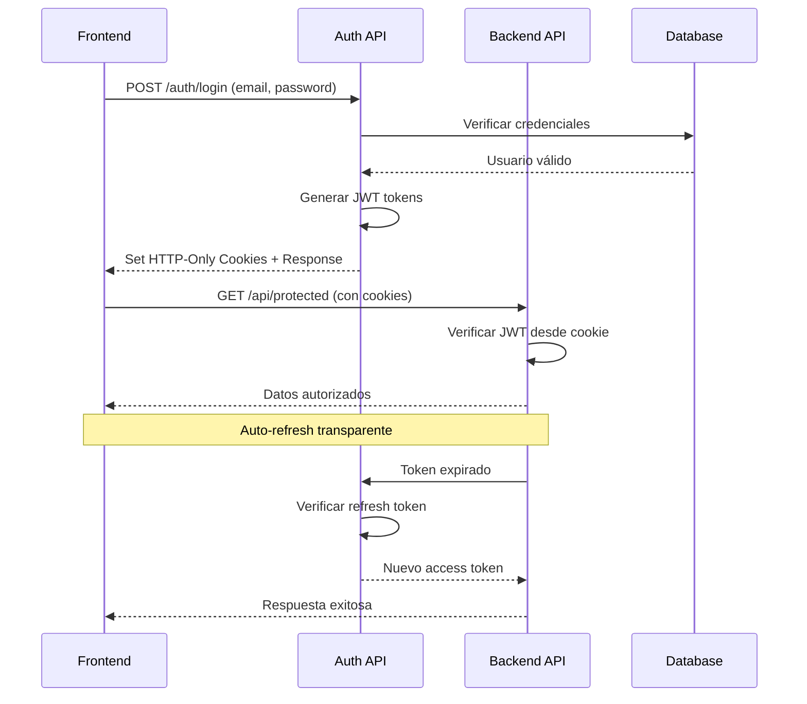

# ArbitrageX Supreme - Guía de Autenticación JWT para Frontend

## 🔐 Sistema de Autenticación JWT

ArbitrageX Supreme utiliza un **sistema híbrido de autenticación JWT** que combina:
- **HTTP-Only Cookies** (recomendado para máxima seguridad)
- **Bearer Tokens** (para APIs y desarrollo)

---

## 🏗️ Arquitectura de Autenticación

### **Flujo de Autenticación Completo**



---

## 🔑 Tokens JWT

### **Access Token**
- **Duración**: 15 minutos (configurable)
- **Almacenamiento**: HTTP-Only Cookie + opcionalmente LocalStorage
- **Uso**: Autenticación de requests API
- **Contenido**:
```json
{
  "userId": "uuid-user-id",
  "tenantId": "uuid-tenant-id", 
  "email": "user@example.com",
  "role": "TRADER",
  "permissions": ["arbitrage:read", "arbitrage:execute"],
  "iat": 1705401000,
  "exp": 1705401900,
  "iss": "arbitragex-supreme"
}
```

### **Refresh Token**
- **Duración**: 7 días (configurable)
- **Almacenamiento**: HTTP-Only Cookie únicamente
- **Uso**: Renovar access token automáticamente
- **Rotación**: Nuevo refresh token en cada renovación

---

## 🌐 Configuración de Cookies

### **Configuración de Seguridad**
```typescript
// Configuración automática del backend
const cookieConfig = {
  httpOnly: true,           // No accesible via JavaScript
  secure: true,             // Solo HTTPS en producción
  sameSite: 'strict',       // Protección CSRF
  path: '/',                // Disponible en toda la app
  maxAge: {
    accessToken: 15 * 60,   // 15 minutos
    refreshToken: 7 * 24 * 60 * 60  // 7 días
  }
};
```

### **Headers de Cookies**
```http
Set-Cookie: accessToken=eyJhbGciOiJIUzI1NiIs...; HttpOnly; Secure; SameSite=Strict; Path=/; Max-Age=900
Set-Cookie: refreshToken=eyJhbGciOiJIUzI1NiIs...; HttpOnly; Secure; SameSite=Strict; Path=/; Max-Age=604800
```

---

## 💻 Implementación Frontend

### **1. Configuración de Axios/Fetch**

#### **Opción A: Fetch con Credentials (Recomendado)**
```typescript
// utils/api.ts
const API_BASE_URL = 'https://api.arbitragexsupreme.com/api/v2';

export const apiClient = {
  async request(endpoint: string, options: RequestInit = {}) {
    const url = `${API_BASE_URL}${endpoint}`;
    
    const config: RequestInit = {
      ...options,
      credentials: 'include', // CRÍTICO: Incluir cookies automáticamente
      headers: {
        'Content-Type': 'application/json',
        ...options.headers,
      },
    };

    const response = await fetch(url, config);
    
    // Manejar respuesta 401 (token expirado)
    if (response.status === 401) {
      // Intentar refresh automático
      const refreshed = await this.refreshToken();
      if (refreshed) {
        // Reintentar request original
        return fetch(url, config);
      } else {
        // Redirigir al login
        window.location.href = '/login';
      }
    }
    
    return response;
  },

  async refreshToken() {
    try {
      const response = await fetch(`${API_BASE_URL}/auth/refresh`, {
        method: 'POST',
        credentials: 'include', // Usar refresh token de cookie
      });
      return response.ok;
    } catch {
      return false;
    }
  }
};
```

#### **Opción B: Axios con Interceptors**
```typescript
// utils/axios.ts
import axios from 'axios';

const apiClient = axios.create({
  baseURL: 'https://api.arbitragexsupreme.com/api/v2',
  withCredentials: true, // CRÍTICO: Incluir cookies
});

// Interceptor para manejo automático de tokens
apiClient.interceptors.response.use(
  (response) => response,
  async (error) => {
    const originalRequest = error.config;
    
    if (error.response?.status === 401 && !originalRequest._retry) {
      originalRequest._retry = true;
      
      try {
        // Intentar refresh
        await apiClient.post('/auth/refresh');
        
        // Reintentar request original
        return apiClient(originalRequest);
      } catch (refreshError) {
        // Redirect a login
        window.location.href = '/login';
      }
    }
    
    return Promise.reject(error);
  }
);

export { apiClient };
```

### **2. Hook de Autenticación**

```typescript
// hooks/useAuth.ts
import { createContext, useContext, useState, useEffect, ReactNode } from 'react';

interface AuthUser {
  id: string;
  email: string;
  tenantId: string;
  role: string;
}

interface AuthContextType {
  user: AuthUser | null;
  permissions: string[];
  features: string[];
  isAuthenticated: boolean;
  isLoading: boolean;
  login: (email: string, password: string, tenantSlug?: string) => Promise<void>;
  logout: () => Promise<void>;
  refreshAuth: () => Promise<void>;
}

const AuthContext = createContext<AuthContextType | undefined>(undefined);

export const AuthProvider = ({ children }: { children: ReactNode }) => {
  const [user, setUser] = useState<AuthUser | null>(null);
  const [permissions, setPermissions] = useState<string[]>([]);
  const [features, setFeatures] = useState<string[]>([]);
  const [isLoading, setIsLoading] = useState(true);

  // Verificar autenticación al cargar
  useEffect(() => {
    checkAuthStatus();
  }, []);

  const checkAuthStatus = async () => {
    try {
      const response = await fetch('/api/v2/auth/me', {
        credentials: 'include'
      });
      
      if (response.ok) {
        const data = await response.json();
        setUser(data.user);
        setPermissions(data.permissions || []);
      }
    } catch (error) {
      console.error('Auth check failed:', error);
    } finally {
      setIsLoading(false);
    }
  };

  const login = async (email: string, password: string, tenantSlug?: string) => {
    setIsLoading(true);
    
    try {
      const response = await fetch('/api/v2/auth/login', {
        method: 'POST',
        headers: {
          'Content-Type': 'application/json',
        },
        credentials: 'include', // Importante para recibir cookies
        body: JSON.stringify({ email, password, tenantSlug })
      });
      
      if (!response.ok) {
        const error = await response.json();
        throw new Error(error.error || 'Login failed');
      }
      
      const data = await response.json();
      setUser(data.user);
      setPermissions(data.permissions || []);
      setFeatures(data.features || []);
      
    } catch (error) {
      console.error('Login error:', error);
      throw error;
    } finally {
      setIsLoading(false);
    }
  };

  const logout = async () => {
    try {
      await fetch('/api/v2/auth/logout', {
        method: 'POST',
        credentials: 'include'
      });
    } catch (error) {
      console.error('Logout error:', error);
    } finally {
      // Limpiar estado local
      setUser(null);
      setPermissions([]);
      setFeatures([]);
      
      // Redirigir al login
      window.location.href = '/login';
    }
  };

  const refreshAuth = async () => {
    await checkAuthStatus();
  };

  const value: AuthContextType = {
    user,
    permissions,
    features,
    isAuthenticated: !!user,
    isLoading,
    login,
    logout,
    refreshAuth
  };

  return (
    <AuthContext.Provider value={value}>
      {children}
    </AuthContext.Provider>
  );
};

export const useAuth = () => {
  const context = useContext(AuthContext);
  if (!context) {
    throw new Error('useAuth must be used within AuthProvider');
  }
  return context;
};
```

### **3. Componente de Login**

```typescript
// components/LoginForm.tsx
import { useState, FormEvent } from 'react';
import { useAuth } from '../hooks/useAuth';
import { useRouter } from 'next/router';

export const LoginForm = () => {
  const [formData, setFormData] = useState({
    email: '',
    password: '',
    tenantSlug: 'ingenio-pichichi' // Valor por defecto
  });
  const [error, setError] = useState('');
  const { login, isLoading } = useAuth();
  const router = useRouter();

  const handleSubmit = async (e: FormEvent) => {
    e.preventDefault();
    setError('');
    
    try {
      await login(formData.email, formData.password, formData.tenantSlug);
      router.push('/dashboard'); // Redirigir al dashboard
    } catch (err: any) {
      setError(err.message || 'Error de autenticación');
    }
  };

  return (
    <div className="min-h-screen flex items-center justify-center bg-gray-50">
      <div className="max-w-md w-full space-y-8 p-8 bg-white rounded-lg shadow-md">
        <div className="text-center">
          <h2 className="text-3xl font-bold text-gray-900">
            ArbitrageX Supreme
          </h2>
          <p className="mt-2 text-gray-600">
            Ingresa a tu cuenta de trading
          </p>
        </div>
        
        <form onSubmit={handleSubmit} className="space-y-6">
          {error && (
            <div className="bg-red-50 border border-red-200 text-red-600 px-4 py-3 rounded-md text-sm">
              {error}
            </div>
          )}
          
          <div>
            <label htmlFor="email" className="block text-sm font-medium text-gray-700">
              Email
            </label>
            <input
              id="email"
              type="email"
              required
              className="mt-1 block w-full px-3 py-2 border border-gray-300 rounded-md shadow-sm focus:ring-blue-500 focus:border-blue-500"
              value={formData.email}
              onChange={(e) => setFormData({ ...formData, email: e.target.value })}
              placeholder="tu@email.com"
            />
          </div>
          
          <div>
            <label htmlFor="password" className="block text-sm font-medium text-gray-700">
              Contraseña
            </label>
            <input
              id="password"
              type="password"
              required
              className="mt-1 block w-full px-3 py-2 border border-gray-300 rounded-md shadow-sm focus:ring-blue-500 focus:border-blue-500"
              value={formData.password}
              onChange={(e) => setFormData({ ...formData, password: e.target.value })}
              placeholder="Tu contraseña segura"
            />
          </div>
          
          <div>
            <label htmlFor="tenantSlug" className="block text-sm font-medium text-gray-700">
              Organización
            </label>
            <input
              id="tenantSlug"
              type="text"
              className="mt-1 block w-full px-3 py-2 border border-gray-300 rounded-md shadow-sm focus:ring-blue-500 focus:border-blue-500"
              value={formData.tenantSlug}
              onChange={(e) => setFormData({ ...formData, tenantSlug: e.target.value })}
              placeholder="ingenio-pichichi"
            />
          </div>
          
          <button
            type="submit"
            disabled={isLoading}
            className="w-full flex justify-center py-3 px-4 border border-transparent rounded-md shadow-sm text-sm font-medium text-white bg-blue-600 hover:bg-blue-700 focus:outline-none focus:ring-2 focus:ring-offset-2 focus:ring-blue-500 disabled:opacity-50 disabled:cursor-not-allowed"
          >
            {isLoading ? (
              <div className="flex items-center">
                <div className="animate-spin rounded-full h-4 w-4 border-b-2 border-white mr-2"></div>
                Ingresando...
              </div>
            ) : (
              'Iniciar Sesión'
            )}
          </button>
        </form>
        
        <div className="text-center">
          <a href="/register" className="text-sm text-blue-600 hover:text-blue-500">
            ¿No tienes cuenta? Regístrate
          </a>
        </div>
      </div>
    </div>
  );
};
```

### **4. Guard de Rutas Protegidas**

```typescript
// components/ProtectedRoute.tsx
import { useAuth } from '../hooks/useAuth';
import { useRouter } from 'next/router';
import { useEffect } from 'react';

interface ProtectedRouteProps {
  children: React.ReactNode;
  requiredPermissions?: string[];
  redirectTo?: string;
}

export const ProtectedRoute = ({ 
  children, 
  requiredPermissions = [], 
  redirectTo = '/login' 
}: ProtectedRouteProps) => {
  const { isAuthenticated, isLoading, permissions } = useAuth();
  const router = useRouter();

  useEffect(() => {
    if (!isLoading && !isAuthenticated) {
      router.push(redirectTo);
      return;
    }

    // Verificar permisos específicos
    if (requiredPermissions.length > 0) {
      const hasPermissions = requiredPermissions.every(perm => 
        permissions.includes(perm)
      );
      
      if (!hasPermissions) {
        router.push('/unauthorized');
        return;
      }
    }
  }, [isAuthenticated, isLoading, permissions, router]);

  // Mostrar loading mientras se verifica auth
  if (isLoading) {
    return (
      <div className="min-h-screen flex items-center justify-center">
        <div className="animate-spin rounded-full h-12 w-12 border-b-2 border-blue-600"></div>
      </div>
    );
  }

  // Solo renderizar si está autenticado y tiene permisos
  if (!isAuthenticated) {
    return null;
  }

  return <>{children}</>;
};

// Ejemplo de uso
export const Dashboard = () => (
  <ProtectedRoute requiredPermissions={['arbitrage:read']}>
    <div>
      {/* Contenido del dashboard */}
    </div>
  </ProtectedRoute>
);
```

---

## 🔒 Seguridad y Mejores Prácticas

### **Configuración HTTPS (Obligatorio en Producción)**
```typescript
// Solo en producción, asegurar HTTPS
if (process.env.NODE_ENV === 'production') {
  // Todas las requests deben usar HTTPS
  if (window.location.protocol !== 'https:') {
    window.location.href = 'https:' + window.location.href.substring(window.location.protocol.length);
  }
}
```

### **CSP (Content Security Policy)**
```html
<!-- Agregar en el HTML head -->
<meta http-equiv="Content-Security-Policy" 
      content="default-src 'self'; 
               script-src 'self' 'unsafe-inline'; 
               connect-src 'self' https://api.arbitragexsupreme.com; 
               img-src 'self' data: https:;">
```

### **Validación de Tokens en Cliente (Opcional)**
```typescript
// utils/tokenValidator.ts
import { jwtDecode } from 'jwt-decode';

export const isTokenExpired = (token: string): boolean => {
  try {
    const decoded = jwtDecode(token);
    const currentTime = Date.now() / 1000;
    return decoded.exp! < currentTime;
  } catch {
    return true;
  }
};

export const getTokenPayload = (token: string) => {
  try {
    return jwtDecode(token);
  } catch {
    return null;
  }
};
```

---

## 🚨 Manejo de Errores de Autenticación

### **Tipos de Errores Comunes**
```typescript
// types/auth.ts
export enum AuthError {
  INVALID_CREDENTIALS = 'Invalid credentials',
  TOKEN_EXPIRED = 'Token expired',
  TOKEN_INVALID = 'Invalid token',
  TENANT_NOT_FOUND = 'Tenant not found',
  USER_SUSPENDED = 'User account suspended',
  PERMISSION_DENIED = 'Permission denied'
}

export const getAuthErrorMessage = (error: string): string => {
  switch (error) {
    case AuthError.INVALID_CREDENTIALS:
      return 'Email o contraseña incorrectos';
    case AuthError.TENANT_NOT_FOUND:
      return 'Organización no encontrada';
    case AuthError.USER_SUSPENDED:
      return 'Tu cuenta ha sido suspendida';
    case AuthError.PERMISSION_DENIED:
      return 'No tienes permisos para esta acción';
    default:
      return 'Error de autenticación';
  }
};
```

### **Interceptor Global de Errores**
```typescript
// utils/errorHandler.ts
export class AuthErrorHandler {
  static handleAuthError(error: any, router: any) {
    const status = error.response?.status;
    const message = error.response?.data?.error;
    
    switch (status) {
      case 401:
        // Token inválido o expirado
        if (message?.includes('expired')) {
          // El interceptor ya manejó el refresh
          return;
        }
        // Redirigir al login
        router.push('/login');
        break;
        
      case 403:
        // Sin permisos
        router.push('/unauthorized');
        break;
        
      case 422:
        // Error de validación
        console.warn('Validation error:', message);
        break;
        
      default:
        console.error('Auth error:', error);
    }
  }
}
```

---

## 🧪 Testing de Autenticación

### **Mock para Testing**
```typescript
// mocks/authMock.ts
export const mockAuthUser = {
  id: 'user_123',
  email: 'test@ingenio-pichichi.com',
  tenantId: 'tenant_456',
  role: 'TRADER'
};

export const mockAuthContext = {
  user: mockAuthUser,
  permissions: ['arbitrage:read', 'arbitrage:execute'],
  features: ['multi_chain_trading'],
  isAuthenticated: true,
  isLoading: false,
  login: jest.fn(),
  logout: jest.fn(),
  refreshAuth: jest.fn()
};

// Test helper
export const renderWithAuth = (component: React.ReactNode) => {
  return render(
    <AuthContext.Provider value={mockAuthContext}>
      {component}
    </AuthContext.Provider>
  );
};
```

---

## ✅ Checklist de Implementación

### **Frontend Setup:**
- [ ] Configurar `credentials: 'include'` en todas las requests
- [ ] Implementar AuthContext y AuthProvider  
- [ ] Crear LoginForm con manejo de errores
- [ ] Configurar ProtectedRoute para rutas protegidas
- [ ] Implementar auto-refresh de tokens
- [ ] Agregar loading states y error handling
- [ ] Configurar interceptors para manejo automático 401/403

### **Seguridad:**
- [ ] Verificar HTTPS en producción
- [ ] Configurar CSP headers apropiados
- [ ] Validar permisos en rutas sensibles
- [ ] Implementar logout automático en múltiples tabs
- [ ] Limpiar datos sensibles del localStorage/sessionStorage

### **UX/UI:**
- [ ] Mostrar estados de loading durante auth
- [ ] Implementar mensajes de error user-friendly
- [ ] Agregar progress indicators durante login
- [ ] Manejar expiración de sesión elegantemente
- [ ] Preservar ruta de destino después del login

---

*Esta guía está optimizada para la integración seamless del sistema de autenticación JWT de ArbitrageX Supreme con cualquier framework frontend moderno, especialmente diseñada para uso con Lovable.dev*