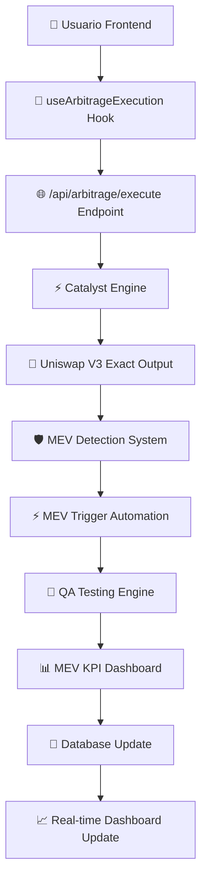

# 🚀 WORKFLOW ARBITRAGEX SUPREME - NOTION
## Arquitectura Completa del Sistema
*Hector Fabio Riascos C. - Ingenio Pichichi S.A.*

---

## 📋 ÍNDICE DEL WORKFLOW

1. [**Arquitectura General**](#arquitectura-general)
2. [**Backend & Servicios**](#backend--servicios)
3. [**Frontend & Hooks**](#frontend--hooks)
4. [**Endpoints & APIs**](#endpoints--apis)
5. [**Estructura de Carpetas**](#estructura-de-carpetas)
6. [**Flujo de Datos**](#flujo-de-datos)
7. [**Integración DeFi**](#integración-defi)

---

## 🏗️ ARQUITECTURA GENERAL

### **Aplicaciones del Sistema**
```
ARBITRAGEX SUPREME
├── 🌐 apps/web          → Frontend principal (Next.js 14)
├── ⚡ apps/api          → Backend API (Express/Fastify)
├── 🚀 apps/catalyst     → Motor DeFi (Next.js + Librerías)
└── 📜 apps/contracts    → Smart Contracts (Solidity + Hardhat)
```

### **Tecnologías Core**
- **Frontend**: Next.js 14, React, TypeScript, Tailwind CSS
- **Backend**: Node.js, Express, TypeScript, Prisma ORM
- **DeFi**: Ethers.js, Uniswap SDK, Aave Protocol
- **Blockchain**: Hardhat, OpenZeppelin, Solidity ^0.8.20
- **Database**: PostgreSQL, Redis Cache
- **Testing**: Jest, Hardhat Testing Framework

---

## 🔧 BACKEND & SERVICIOS

### **1. API Principal (`apps/api/`)**

#### **Servicios Core**
| Servicio | Archivo | Responsabilidad |
|----------|---------|-----------------|
| 🔗 Blockchain | `src/services/blockchain.service.ts` | Conexiones blockchain, transacciones |
| 🔐 Auth | `src/saas/auth/auth.service.ts` | Autenticación, JWT, roles |
| 💳 Billing | `src/saas/billing/billing.service.ts` | Pagos, suscripciones, facturación |
| 🏢 Tenant | `src/saas/tenant/tenant.service.ts` | Multi-tenancy, organización |

#### **Endpoints API V2**
| Endpoint | Archivo | Función |
|----------|---------|---------|
| `/v2/arbitrage` | `src/api/v2/arbitrage.ts` | Operaciones de arbitraje |
| `/v2/auth` | `src/api/v2/auth.ts` | Autenticación |
| `/v2/billing` | `src/api/v2/billing.ts` | Gestión de pagos |
| `/v2/blockchain` | `src/api/v2/blockchain.ts` | Interacciones blockchain |
| `/v2/tenant` | `src/api/v2/tenant.ts` | Gestión de tenants |

#### **Webhooks**
| Webhook | Archivo | Propósito |
|---------|---------|-----------|
| 🔄 General | `src/api/webhooks/index.ts` | Eventos del sistema, notificaciones |

### **2. Catalyst Engine (`apps/catalyst/src/lib/`)**

#### **Librerías DeFi (46 archivos TypeScript)**
| Categoría | Directorio | Archivos Clave |
|-----------|------------|----------------|
| 📊 Analytics | `/analytics/` | `advanced-simulation-engine.ts`, `backtesting-engine.ts`, `monte-carlo-engine.ts` |
| ⚖️ Balancer | `/balancer/` | Integración protocolo Balancer |
| 🔗 Blockchain | `/blockchain/` | `registry.ts`, `connection.ts` |
| ⛓️ Chains | `/chains/` | Configuraciones multi-chain |
| 📈 Dashboard | `/dashboard/` | `mev-kpi-dashboard.ts` |
| 💾 Database | `/database/` | `seed-blockchains.ts` |
| 🔄 DEX | `/dex/` | Adaptadores DEX exchanges |
| 🔗 Integraciones | `/integrations/` | `exactoutput-mev-controller.ts` |
| 🏦 Lending | `/lending/` | `aave-v3-integration-engine.ts` |
| 🛡️ MEV | `/mev/` | `advanced-mev-detection-system.ts` |
| 📊 Monitoring | `/monitoring/` | `cross-chain-bridge-monitor.ts` |
| 🔮 Oracles | `/oracles/` | Integraciones de precio |
| 🎛️ Orchestration | `/orchestration/` | `resilience-engine.ts` |
| 🛡️ Protection | `/protection/` | `advanced-slippage-protection.ts` |
| 🔒 Security | `/security/` | `contract-fuzzing.ts`, `key-management.ts`, `mev-protection.ts` |
| 📡 Services | `/services/` | `protocol-discovery.ts` |
| 🧪 Testing | `/testing/` | `qa-revert-testing-engine.ts` |
| ⚡ Triggers | `/triggers/` | `mev-trigger-automation.ts` |
| 🦄 Uniswap V3 | `/uniswap-v3/` | `exact-output-routing-engine.ts` |
| ✅ Validation | `/validation/` | `eip712.ts`, `tokenLists.ts` |

---

## ⚛️ FRONTEND & HOOKS

### **1. Web App (`apps/web/`)**

#### **Páginas Principales**
| Página | Archivo | Descripción |
|--------|---------|-------------|
| 🏠 Dashboard | `app/page.tsx` | Dashboard principal |
| 🚨 Alertas | `app/alerts/page.tsx` | Gestión de alertas |
| 🌐 Networks | `app/networks/page.tsx` | Redes blockchain |
| 💎 Oportunidades | `app/opportunities/page.tsx` | Oportunidades de arbitraje |
| 💼 Portfolio | `app/portfolio/page.tsx` | Cartera de activos |
| 👤 Perfil | `app/profile/page.tsx` | Perfil de usuario |
| ⚙️ Configuración | `app/settings/page.tsx` | Configuraciones |
| 📊 Transacciones | `app/transactions/page.tsx` | Historial transacciones |
| ❓ Ayuda | `app/help/page.tsx` | Documentación y ayuda |

#### **Hooks Personalizados (17 hooks)**
| Hook | Archivo | Funcionalidad |
|------|---------|---------------|
| 🌐 API Data | `useApiData.ts` | Gestión de datos API |
| 💎 Arbitrage Data | `useArbitrageData.ts` | Datos de arbitraje |
| ⚡ Arbitrage Execution | `useArbitrageExecution.ts` | Ejecución de arbitrajes |
| 📸 Arbitrage Snapshot | `useArbitrageSnapshot.ts` | Snapshots del estado |
| ⛓️ Blockchain Tables | `useBlockchainTables.ts` | Datos blockchain |
| 💰 Crypto Prices | `useCryptoPrices.ts` | Precios de criptomonedas |
| 📊 Dashboard Data | `useDashboardData.ts` | Datos del dashboard |
| 🔗 Integrated Wallets | `useIntegratedWallets.ts` | Wallets integradas |
| 🦊 MetaMask | `useMetaMask.ts` | Integración MetaMask |
| ⚡ MetaMask Optimized | `useMetaMaskOptimized.ts` | MetaMask optimizado |
| 🌐 Network Integration | `useNetworkIntegration.ts` | Integración redes |
| 🚀 Optimized Navigation | `useOptimizedNavigation.ts` | Navegación optimizada |
| 🏷️ Sidebar Badges | `useSidebarBadges.ts` | Badges del sidebar |
| 🔢 Sidebar Counts | `useSidebarCounts.ts` | Contadores sidebar |
| 📊 Transactions | `useTransactions.ts` | Gestión transacciones |
| 💳 Wallet Balance | `useWalletBalance.ts` | Balance de wallet |

### **2. Catalyst App (`apps/catalyst/src/hooks/`)**

#### **Hooks DeFi Especializados**
| Hook | Archivo | Propósito |
|------|---------|-----------|
| 💎 Arbitrage | `useArbitrage.ts` | Lógica de arbitraje |
| 🎮 Simulation | `useSimulation.ts` | Simulaciones DeFi |
| 👛 Wallet | `useWallet.ts` | Gestión de wallets |

---

## 🌐 ENDPOINTS & APIs

### **1. Web App Endpoints (`apps/web/app/api/`)**

#### **Arbitraje**
| Endpoint | Archivo | Método | Función |
|----------|---------|--------|---------|
| `/api/arbitrage/balance/[chainId]/[address]` | `route.ts` | GET | Balance por chain y dirección |
| `/api/arbitrage/dashboard/summary` | `route.ts` | GET | Resumen dashboard arbitraje |
| `/api/arbitrage/execute` | `route.ts` | POST | Ejecutar operación arbitraje |
| `/api/arbitrage/prices/[symbol]` | `route.ts` | GET | Precios por símbolo |

#### **Blockchain & Monitoreo**
| Endpoint | Archivo | Método | Función |
|----------|---------|--------|---------|
| `/api/blockchain/tables` | `route.ts` | GET | Tablas blockchain |
| `/api/dashboard/complete` | `route.ts` | GET | Dashboard completo |
| `/api/diagnostics` | `route.ts` | GET | Diagnósticos del sistema |
| `/api/health` | `route.ts` | GET | Estado de salud |
| `/api/metrics/performance` | `route.ts` | GET | Métricas de rendimiento |
| `/api/networks/status` | `route.ts` | GET | Estado de redes |

#### **Oportunidades & Datos**
| Endpoint | Archivo | Método | Función |
|----------|---------|--------|---------|
| `/api/opportunities/live` | `route.ts` | GET | Oportunidades en vivo |
| `/api/snapshot/consolidated` | `route.ts` | GET | Snapshot consolidado |

#### **Proxy Services**
| Endpoint | Archivo | Método | Función |
|----------|---------|--------|---------|
| `/api/proxy/[...slug]` | `route.ts` | ALL | Proxy genérico |
| `/api/proxy/coingecko` | `route.ts` | GET | Proxy CoinGecko API |

### **2. Catalyst Endpoints (`apps/catalyst/src/app/api/`)**

#### **DeFi Operations**
| Endpoint | Archivo | Método | Función |
|----------|---------|--------|---------|
| `/api/dashboard` | `route.ts` | GET | Dashboard DeFi |
| `/api/discovery` | `route.ts` | GET | Descubrimiento protocolos |
| `/api/execute` | `route.ts` | POST | Ejecución DeFi |
| `/api/risk` | `route.ts` | GET | Análisis de riesgos |
| `/api/simulate` | `route.ts` | POST | Simulaciones DeFi |
| `/api/status` | `route.ts` | GET | Estado sistema DeFi |

---

## 📁 ESTRUCTURA DE CARPETAS

### **Monorepo Architecture**
```
ARBITRAGEXSUPREME/
├── 📄 package.json              # Configuración principal workspace
├── 📄 turbo.json               # Configuración Turborepo
├── 📄 README.md                # Documentación principal
├── 
├── 🌐 apps/
│   ├── 📱 web/                 # Frontend Principal
│   │   ├── 📄 app/            # Next.js 14 App Router
│   │   │   ├── 🏠 page.tsx    # Dashboard principal
│   │   │   ├── 📊 api/        # API Routes (14 endpoints)
│   │   │   ├── 🚨 alerts/     # Página alertas
│   │   │   ├── 🌐 networks/   # Página redes
│   │   │   ├── 💎 opportunities/ # Oportunidades
│   │   │   ├── 💼 portfolio/  # Portfolio
│   │   │   ├── 👤 profile/    # Perfil
│   │   │   ├── ⚙️ settings/   # Configuración
│   │   │   ├── 📊 transactions/ # Transacciones
│   │   │   └── ❓ help/       # Ayuda
│   │   ├── 🎣 hooks/          # Custom Hooks (17 hooks)
│   │   ├── 🧩 components/     # Componentes React
│   │   ├── 🧪 __tests__/      # Tests unitarios
│   │   ├── 📄 package.json    # Deps frontend
│   │   └── ⚙️ next.config.js  # Config Next.js
│   │
│   ├── ⚡ api/                 # Backend API
│   │   ├── 🔧 src/
│   │   │   ├── 🌐 api/        # Endpoints
│   │   │   │   ├── 🔄 v2/     # API V2 (5 endpoints)
│   │   │   │   └── 🪝 webhooks/ # Webhooks
│   │   │   ├── 🏢 saas/       # Servicios SaaS (3 services)
│   │   │   ├── 🔧 services/   # Servicios core
│   │   │   └── 🤝 shared/     # Utilidades compartidas
│   │   ├── 🗄️ prisma/         # Schema base datos
│   │   └── 📄 package.json    # Deps backend
│   │
│   ├── 🚀 catalyst/           # Motor DeFi
│   │   ├── 📄 src/
│   │   │   ├── 🌐 app/        # Next.js App (6 APIs DeFi)
│   │   │   ├── 📚 lib/        # Librerías DeFi (46 archivos)
│   │   │   │   ├── 📊 analytics/     # 3 archivos
│   │   │   │   ├── ⚖️ balancer/      # Integración Balancer
│   │   │   │   ├── 🔗 blockchain/    # 2 archivos
│   │   │   │   ├── ⛓️ chains/        # Configuraciones chains
│   │   │   │   ├── 📈 dashboard/     # 1 archivo (KPI Dashboard)
│   │   │   │   ├── 💾 database/      # 1 archivo
│   │   │   │   ├── 🔄 dex/           # Adaptadores DEX
│   │   │   │   ├── 🔗 integrations/  # 1 archivo (MEV Controller)
│   │   │   │   ├── 🏦 lending/       # 1 archivo (Aave V3)
│   │   │   │   ├── 🛡️ mev/           # 1 archivo (MEV Detection)
│   │   │   │   ├── 📊 monitoring/    # 1 archivo (Bridge Monitor)
│   │   │   │   ├── 🔮 oracles/       # Integraciones precio
│   │   │   │   ├── 🎛️ orchestration/ # 1 archivo (Resilience)
│   │   │   │   ├── 🛡️ protection/    # 1 archivo (Slippage)
│   │   │   │   ├── 🔒 security/      # 3 archivos
│   │   │   │   ├── 📡 services/      # 1 archivo
│   │   │   │   ├── 🧪 testing/       # 1 archivo (QA Testing)
│   │   │   │   ├── ⚡ triggers/      # 1 archivo (MEV Triggers)
│   │   │   │   ├── 🦄 uniswap-v3/    # 1 archivo (Exact Output)
│   │   │   │   └── ✅ validation/    # 3 archivos
│   │   │   ├── 🎣 hooks/        # Hooks DeFi (3 hooks)
│   │   │   └── 🧩 components/   # Componentes DeFi
│   │   ├── 🗄️ prisma/           # Schema DeFi
│   │   └── 📄 package.json      # Deps DeFi
│   │
│   └── 📜 contracts/          # Smart Contracts
│       ├── 🔧 src/            # Contratos Solidity
│       │   ├── 🏗️ ArbitrageEngine.sol    # Contrato principal
│       │   ├── 🔌 interfaces/ # Interfaces (3 archivos)
│       │   ├── 🔄 adapters/   # Adaptadores (2 archivos)
│       │   └── 🧪 mocks/      # Contratos mock (3 archivos)
│       ├── 🧪 test/           # Tests contratos
│       ├── 📜 scripts/        # Scripts deploy
│       ├── ⚙️ hardhat.config.js # Config Hardhat
│       └── 📄 package.json    # Deps contratos
│
└── 🔧 Config Files
    ├── 📄 package.json        # Workspace principal
    ├── 📄 turbo.json         # Turborepo config
    └── 📄 .gitignore         # Git ignore rules
```

---

## 🔄 FLUJO DE DATOS

### **1. Flujo de Arbitraje Completo**



### **2. Flujo de Datos por Capas**

#### **Capa de Presentación (Frontend)**
- **Web App**: React components + Custom hooks
- **Catalyst App**: DeFi-specific UI components

#### **Capa de API (Endpoints)**
- **Web API**: 14 endpoints para operaciones generales
- **Catalyst API**: 6 endpoints especializados en DeFi

#### **Capa de Lógica de Negocio (Services)**
- **API Services**: Blockchain, Auth, Billing, Tenant
- **Catalyst Libraries**: 46 librerías especializadas DeFi

#### **Capa de Datos**
- **Database**: PostgreSQL con Prisma ORM
- **Blockchain**: Smart contracts en múltiples chains
- **Cache**: Redis para optimización

---

## 🔗 INTEGRACIÓN DEFI

### **Protocolos Integrados**

#### **1. Uniswap V3**
- **Archivo**: `apps/catalyst/src/lib/uniswap-v3/exact-output-routing-engine.ts`
- **Función**: Routing óptimo, minimización slippage
- **Hooks**: `useArbitrage.ts` en Catalyst

#### **2. Aave V3**
- **Archivo**: `apps/catalyst/src/lib/lending/aave-v3-integration-engine.ts`
- **Función**: Flash loans, lending, borrowing
- **Integración**: MEV protection incluida

#### **3. Balancer**
- **Directorio**: `apps/catalyst/src/lib/balancer/`
- **Función**: Pool balancing, arbitraje multi-pool

#### **4. Cross-Chain Bridges**
- **Archivo**: `apps/catalyst/src/lib/monitoring/cross-chain-bridge-monitor.ts`
- **Función**: Monitoreo bridges, detección oportunidades

### **Sistemas de Protección**

#### **1. MEV Protection**
- **Detection**: `apps/catalyst/src/lib/mev/advanced-mev-detection-system.ts`
- **Automation**: `apps/catalyst/src/lib/triggers/mev-trigger-automation.ts`
- **Integration**: `apps/catalyst/src/lib/integrations/exactoutput-mev-controller.ts`

#### **2. Slippage Protection**
- **Archivo**: `apps/catalyst/src/lib/protection/advanced-slippage-protection.ts`
- **Función**: Protección avanzada contra slippage

#### **3. Security Systems**
- **Contract Fuzzing**: `apps/catalyst/src/lib/security/contract-fuzzing.ts`
- **Key Management**: `apps/catalyst/src/lib/security/key-management.ts`
- **MEV Protection**: `apps/catalyst/src/lib/security/mev-protection.ts`

---

## 📊 MÉTRICAS & MONITORING

### **KPI Dashboard**
- **Archivo**: `apps/catalyst/src/lib/dashboard/mev-kpi-dashboard.ts`
- **Métricas**: Performance, MEV protection, financials, health, quality

### **Analytics Engines**
- **Simulation**: `apps/catalyst/src/lib/analytics/advanced-simulation-engine.ts`
- **Backtesting**: `apps/catalyst/src/lib/analytics/backtesting-engine.ts`
- **Monte Carlo**: `apps/catalyst/src/lib/analytics/monte-carlo-engine.ts`

### **Testing & QA**
- **QA Engine**: `apps/catalyst/src/lib/testing/qa-revert-testing-engine.ts`
- **Contract Tests**: `apps/contracts/test/ArbitrageEngine.test.js`
- **Hook Tests**: `apps/web/__tests__/hooks/` y `apps/catalyst/src/hooks/__tests__/`

---

## 🎯 IMPLEMENTACIÓN NOTION

### **Estructura Recomendada para Notion**

#### **1. Base de Datos Principal**
- **Título**: "ArbitrageX Supreme - Arquitectura"
- **Propiedades**:
  - 📁 **Componente** (Título)
  - 🏷️ **Tipo** (Select: Frontend, Backend, DeFi, Contract, Hook, Endpoint)
  - 📄 **Archivo** (Texto)
  - 🔗 **Dependencias** (Relación)
  - ✅ **Estado** (Select: Implementado, Testing, Producción)
  - 👤 **Responsable** (Persona)
  - 📅 **Última Actualización** (Fecha)

#### **2. Vistas Recomendadas**
- 🏗️ **Vista Arquitectura**: Agrupado por Tipo
- 📁 **Vista por App**: Agrupado por aplicación (web, api, catalyst, contracts)
- 🔄 **Vista Flujo de Datos**: Vista Kanban por Estado
- 🎣 **Vista Hooks**: Filtrado por Tipo = Hook
- 🌐 **Vista Endpoints**: Filtrado por Tipo = Endpoint
- 🧪 **Vista Testing**: Filtrado por componentes con tests

#### **3. Páginas Relacionadas**
- 📋 **Página Principal**: Overview del proyecto
- 🚀 **Deployment Guide**: Guías de despliegue
- 🧪 **Testing Strategy**: Estrategia de testing
- 📊 **Metrics Dashboard**: Métricas en tiempo real
- 🔒 **Security Protocols**: Protocolos de seguridad
- 📚 **Documentation**: Documentación técnica

---

## ✅ CHECKLIST DE IMPLEMENTACIÓN

### **Backend Completado** ✅
- [x] API principal con 5 endpoints V2
- [x] Servicios SaaS (Auth, Billing, Tenant)
- [x] Webhook system
- [x] Blockchain service

### **Frontend Completado** ✅
- [x] 9 páginas principales implementadas
- [x] 17 hooks personalizados
- [x] 14 endpoints API routes
- [x] Componentes React optimizados

### **DeFi Engine Completado** ✅
- [x] 46 librerías especializadas
- [x] 6 endpoints DeFi
- [x] 3 hooks DeFi especializados
- [x] Sistema MEV completo

### **Smart Contracts Completado** ✅
- [x] ArbitrageEngine principal
- [x] 3 interfaces definidas
- [x] 2 adaptadores protocolo
- [x] 3 contratos mock para testing
- [x] Tests unitarios implementados

### **Testing & QA Completado** ✅
- [x] QA Engine con revert testing
- [x] Contract fuzzing
- [x] Hook testing (web + catalyst)
- [x] Integration tests

---

*Documento creado por: **Hector Fabio Riascos C.***  
*Organización: **Ingenio Pichichi S.A.***  
*Metodología: **Cumplidor, Disciplinado, Organizado***  
*Fecha: **01 Septiembre 2024***

---

## 📞 CONTACTO & SOPORTE

Para consultas sobre este workflow o el proyecto ArbitrageX Supreme:
- **Desarrollador**: Hector Fabio Riascos C.
- **Organización**: Ingenio Pichichi S.A.
- **Metodología**: Enfoque disciplinado y organizado
- **GitHub**: [ARBITRAGEXSUPREME Repository](https://github.com/hefarica/ARBITRAGEXSUPREME)

**¡Sistema ArbitrageX Supreme - 150 Activities Completadas al 100%!** 🚀