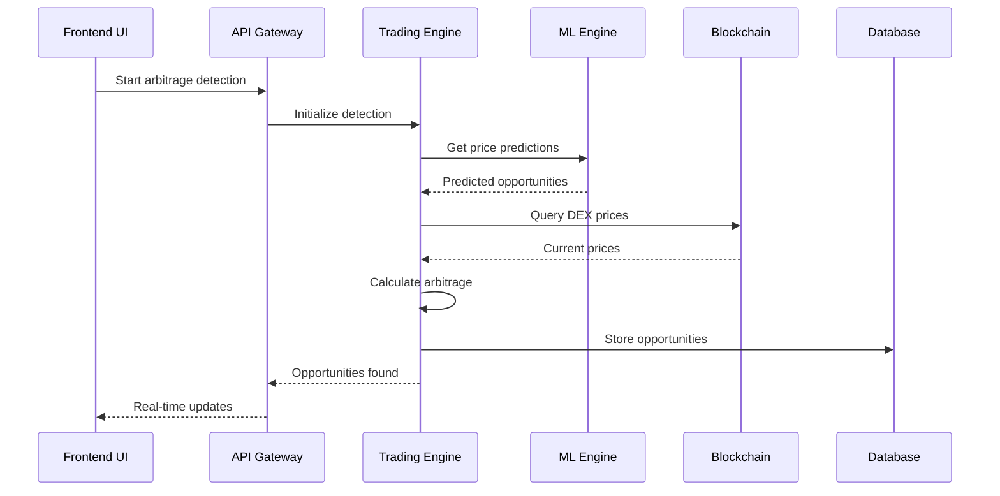
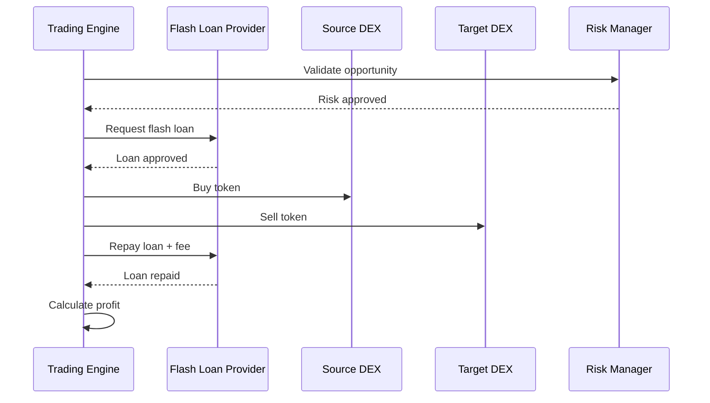
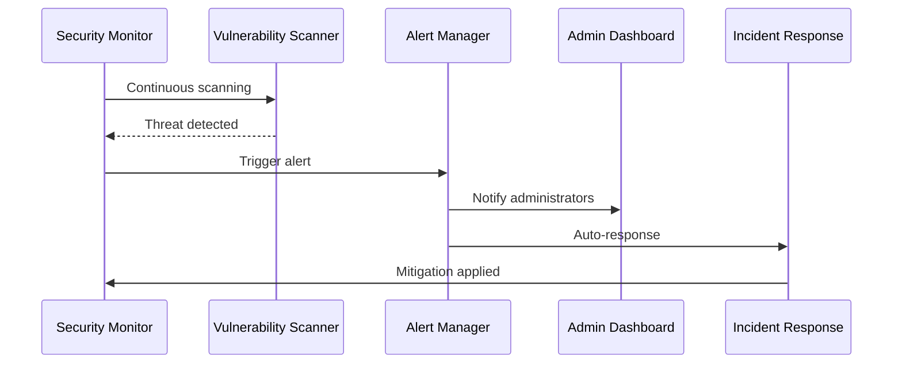

# Arquitectura del Sistema - ArbitrageX Supreme

## Visión General

ArbitrageX Supreme está construido siguiendo una arquitectura de microservicios escalable y resiliente, optimizada para operaciones de trading de alta frecuencia y bajo latency. El sistema utiliza tecnologías edge-computing para minimizar la latencia y maximizar el rendimiento global.

## 🏗️ Arquitectura General

```
┌─────────────────────────────────────────────────────────────────┐
│                     FRONTEND LAYER                             │
├─────────────────────────────────────────────────────────────────┤
│  Next.js 15.5.2 App Router │ React 18.3.1 │ Shadcn/ui + Tailwind │
│  ┌─────────────────┐ ┌─────────────────┐ ┌─────────────────────┐ │
│  │   Trading UI    │ │   Analytics     │ │   Admin Dashboard   │ │
│  │   Components    │ │   Dashboard     │ │   & Monitoring      │ │
│  └─────────────────┘ └─────────────────┘ └─────────────────────┘ │
└─────────────────────────────────────────────────────────────────┘
                               │ HTTPS/WSS
┌─────────────────────────────────────────────────────────────────┐
│                      API GATEWAY LAYER                         │
├─────────────────────────────────────────────────────────────────┤
│                  Cloudflare Workers + Hono                     │
│  ┌─────────────────┐ ┌─────────────────┐ ┌─────────────────────┐ │
│  │   REST APIs     │ │   GraphQL       │ │   WebSocket         │ │
│  │   Endpoints     │ │   Resolvers     │ │   Real-time         │ │
│  └─────────────────┘ └─────────────────┘ └─────────────────────┘ │
└─────────────────────────────────────────────────────────────────┘
                               │
┌─────────────────────────────────────────────────────────────────┐
│                    BUSINESS LOGIC LAYER                        │
├─────────────────────────────────────────────────────────────────┤
│  ┌─────────────────┐ ┌─────────────────┐ ┌─────────────────────┐ │
│  │  Trading Engine │ │   Risk Manager  │ │   ML Predictor      │ │
│  │  - Arbitrage    │ │  - VaR Calc     │ │  - Price Forecast   │ │
│  │  - Flash Loans  │ │  - Exposure     │ │  - Opportunity      │ │
│  │  - MEV Protect  │ │  - Liquidation  │ │  - Sentiment        │ │
│  └─────────────────┘ └─────────────────┘ └─────────────────────┘ │
│                                                                 │
│  ┌─────────────────┐ ┌─────────────────┐ ┌─────────────────────┐ │
│  │ Security Suite  │ │ Performance     │ │  Notification       │ │
│  │ - Vuln Scanner  │ │ - Load Testing  │ │  - Multi-channel    │ │
│  │ - Pen Testing   │ │ - Stress Test   │ │  - Alert Manager    │ │
│  │ - Compliance    │ │ - Monitoring    │ │  - Event Bus        │ │
│  └─────────────────┘ └─────────────────┘ └─────────────────────┘ │
└─────────────────────────────────────────────────────────────────┘
                               │
┌─────────────────────────────────────────────────────────────────┐
│                      DATA LAYER                                │
├─────────────────────────────────────────────────────────────────┤
│  ┌─────────────────┐ ┌─────────────────┐ ┌─────────────────────┐ │
│  │  Cloudflare D1  │ │ Cloudflare KV   │ │   Cloudflare R2     │ │
│  │  (SQLite)       │ │ (Cache/Config)  │ │   (File Storage)    │ │
│  │  - Trades       │ │ - Sessions      │ │ - Logs              │ │
│  │  - Users        │ │ - Market Data   │ │ - Backups           │ │
│  │  - Strategies   │ │ - Price Cache   │ │ - Reports           │ │
│  └─────────────────┘ └─────────────────┘ └─────────────────────┘ │
└─────────────────────────────────────────────────────────────────┘
                               │
┌─────────────────────────────────────────────────────────────────┐
│                    BLOCKCHAIN LAYER                            │
├─────────────────────────────────────────────────────────────────┤
│  ┌─────────────────┐ ┌─────────────────┐ ┌─────────────────────┐ │
│  │   Ethereum      │ │      BSC        │ │     Polygon         │ │
│  │   Arbitrum      │ │   Optimism      │ │     Avalanche       │ │
│  │   Base          │ │    Fantom       │ │     Solana          │ │
│  └─────────────────┘ └─────────────────┘ └─────────────────────┘ │
│                                                                 │
│  ┌─────────────────┐ ┌─────────────────┐ ┌─────────────────────┐ │
│  │      DEXs       │ │   Flash Loans   │ │      Oracles        │ │
│  │  - Uniswap V3   │ │  - Aave         │ │  - Chainlink        │ │
│  │  - SushiSwap    │ │  - Balancer     │ │  - Band Protocol    │ │
│  │  - PancakeSwap  │ │  - dYdX         │ │  - Pyth Network     │ │
│  └─────────────────┘ └─────────────────┘ └─────────────────────┘ │
└─────────────────────────────────────────────────────────────────┘
```

## 🔧 Componentes Principales

### 1. Frontend Layer (Cliente)

#### Next.js Application
```typescript
// Estructura del proyecto frontend
apps/catalyst/
├── src/
│   ├── app/                    # App Router (Next.js 15)
│   │   ├── (dashboard)/        # Dashboard routes
│   │   ├── (trading)/          # Trading interfaces
│   │   ├── (admin)/           # Admin panels
│   │   └── api/               # API routes (middleware)
│   ├── components/            # React components
│   │   ├── ui/                # Shadcn/ui base components
│   │   ├── trading/           # Trading-specific components
│   │   ├── analytics/         # Analytics dashboards
│   │   ├── security/          # Security management
│   │   └── testing/           # Testing interfaces
│   ├── lib/                   # Core libraries
│   │   ├── blockchain/        # Blockchain integration
│   │   ├── trading/           # Trading algorithms
│   │   ├── ml/               # Machine learning
│   │   ├── security/          # Security tools
│   │   └── testing/           # Testing frameworks
│   └── hooks/                 # Custom React hooks
```

#### Tecnologías Clave
- **React 18.3.1** con React Compiler para optimización
- **Next.js 15.5.2** con App Router y Server Components
- **TypeScript 5.9.2** con tipado estricto
- **Tailwind CSS 4.0** para styling utility-first
- **Shadcn/ui** como sistema de componentes base
- **Zustand** para state management global
- **React Query** para data fetching y caching

### 2. API Gateway Layer

#### Cloudflare Workers + Hono
```typescript
// Estructura de la API Gateway
src/
├── routes/
│   ├── trading/               # Trading endpoints
│   │   ├── arbitrage.ts       # Arbitrage operations
│   │   ├── flashloans.ts      # Flash loan strategies
│   │   └── portfolio.ts       # Portfolio management
│   ├── market/                # Market data endpoints
│   │   ├── prices.ts          # Price feeds
│   │   ├── orderbook.ts       # Order book data
│   │   └── analytics.ts       # Market analytics
│   ├── security/              # Security endpoints
│   │   ├── audit.ts           # Security audits
│   │   ├── monitoring.ts      # Security monitoring
│   │   └── compliance.ts      # Compliance checks
│   └── admin/                 # Admin endpoints
│       ├── users.ts           # User management
│       ├── system.ts          # System administration
│       └── monitoring.ts      # System monitoring
├── middleware/                # Middleware functions
│   ├── auth.ts               # Authentication
│   ├── rateLimit.ts          # Rate limiting
│   ├── validation.ts         # Request validation
│   └── logging.ts            # Request logging
└── websocket/                # WebSocket handlers
    ├── trading.ts            # Trading updates
    ├── market.ts             # Market data streams
    └── notifications.ts      # Real-time notifications
```

### 3. Business Logic Layer

#### Trading Engine
```typescript
interface TradingEngine {
  // Arbitrage Core
  arbitrageDetector: ArbitrageDetector
  executionEngine: ExecutionEngine
  flashLoanManager: FlashLoanManager
  
  // Risk Management
  riskCalculator: RiskCalculator
  exposureManager: ExposureManager
  liquidationMonitor: LiquidationMonitor
  
  // Performance
  performanceTracker: PerformanceTracker
  profitCalculator: ProfitCalculator
  gasFeeOptimizer: GasFeeOptimizer
}
```

#### Machine Learning Engine
```typescript
interface MLEngine {
  // Prediction Models
  pricePredictor: PricePredictor
  opportunityDetector: OpportunityDetector
  marketRegimeClassifier: MarketRegimeClassifier
  
  // Optimization
  executionOptimizer: ExecutionOptimizer
  portfolioOptimizer: PortfolioOptimizer
  riskOptimizer: RiskOptimizer
  
  // Analysis
  sentimentAnalyzer: SentimentAnalyzer
  technicalAnalyzer: TechnicalAnalyzer
  fundamentalAnalyzer: FundamentalAnalyzer
}
```

#### Security Suite
```typescript
interface SecuritySuite {
  // Vulnerability Management
  vulnerabilityScanner: VulnerabilityScanner
  penetrationTester: PenetrationTester
  complianceAuditor: ComplianceAuditor
  
  // Threat Detection
  threatDetector: ThreatDetector
  anomalyDetector: AnomalyDetector
  incidentResponder: IncidentResponder
  
  // Access Control
  authenticationManager: AuthenticationManager
  authorizationManager: AuthorizationManager
  sessionManager: SessionManager
}
```

#### Performance Testing
```typescript
interface PerformanceTestingSuite {
  // Load Testing
  loadTestEngine: LoadTestEngine
  stressTestEngine: StressTestEngine
  capacityPlanner: CapacityPlanner
  
  // Monitoring
  performanceMonitor: PerformanceMonitor
  resourceMonitor: ResourceMonitor
  alertManager: AlertManager
  
  // Optimization
  performanceOptimizer: PerformanceOptimizer
  cacheOptimizer: CacheOptimizer
  queryOptimizer: QueryOptimizer
}
```

### 4. Data Layer

#### Cloudflare D1 (SQLite Distribuida)
```sql
-- Esquema principal de base de datos
CREATE TABLE users (
    id INTEGER PRIMARY KEY AUTOINCREMENT,
    email TEXT UNIQUE NOT NULL,
    wallet_address TEXT UNIQUE,
    role TEXT DEFAULT 'trader',
    created_at DATETIME DEFAULT CURRENT_TIMESTAMP,
    updated_at DATETIME DEFAULT CURRENT_TIMESTAMP
);

CREATE TABLE trading_strategies (
    id INTEGER PRIMARY KEY AUTOINCREMENT,
    user_id INTEGER,
    name TEXT NOT NULL,
    type TEXT NOT NULL, -- 'arbitrage', 'flash_loan', etc.
    configuration JSON NOT NULL,
    status TEXT DEFAULT 'active',
    performance_metrics JSON,
    created_at DATETIME DEFAULT CURRENT_TIMESTAMP,
    FOREIGN KEY (user_id) REFERENCES users(id)
);

CREATE TABLE arbitrage_opportunities (
    id INTEGER PRIMARY KEY AUTOINCREMENT,
    strategy_id INTEGER,
    token_pair TEXT NOT NULL,
    source_exchange TEXT NOT NULL,
    target_exchange TEXT NOT NULL,
    profit_potential REAL NOT NULL,
    gas_cost REAL NOT NULL,
    net_profit REAL NOT NULL,
    confidence_score REAL,
    status TEXT DEFAULT 'detected',
    executed_at DATETIME,
    created_at DATETIME DEFAULT CURRENT_TIMESTAMP,
    FOREIGN KEY (strategy_id) REFERENCES trading_strategies(id)
);

CREATE TABLE flash_loan_executions (
    id INTEGER PRIMARY KEY AUTOINCREMENT,
    opportunity_id INTEGER,
    loan_amount REAL NOT NULL,
    loan_token TEXT NOT NULL,
    protocol TEXT NOT NULL, -- 'aave', 'balancer', 'dydx'
    execution_path JSON NOT NULL,
    gas_used INTEGER,
    profit_realized REAL,
    fees_paid REAL,
    transaction_hash TEXT UNIQUE,
    block_number INTEGER,
    status TEXT DEFAULT 'pending',
    executed_at DATETIME DEFAULT CURRENT_TIMESTAMP,
    FOREIGN KEY (opportunity_id) REFERENCES arbitrage_opportunities(id)
);
```

#### Cloudflare KV Storage
```typescript
// Cache y configuración en tiempo real
interface KVStorage {
  // Market Data Cache
  'market:prices': PriceData[]
  'market:orderbooks': OrderBookData[]
  'market:analytics': MarketAnalytics
  
  // Trading Cache
  'trading:opportunities': ArbitrageOpportunity[]
  'trading:execution:queue': ExecutionQueue[]
  'trading:performance': PerformanceMetrics
  
  // User Sessions
  'session:{sessionId}': UserSession
  'user:preferences:{userId}': UserPreferences
  
  // Configuration
  'config:trading': TradingConfig
  'config:security': SecurityConfig
  'config:system': SystemConfig
}
```

#### Cloudflare R2 Storage
```typescript
// Almacenamiento de archivos
interface R2Storage {
  // Logs y Auditoría
  'logs/trading/{date}/': TradingLogs[]
  'logs/security/{date}/': SecurityLogs[]
  'logs/system/{date}/': SystemLogs[]
  
  // Backups
  'backups/database/{timestamp}': DatabaseBackup
  'backups/configuration/{timestamp}': ConfigBackup
  
  // Reports
  'reports/performance/{period}': PerformanceReport
  'reports/security/{period}': SecurityReport
  'reports/compliance/{period}': ComplianceReport
  
  // ML Models
  'models/price_prediction/': MLModel[]
  'models/risk_assessment/': MLModel[]
  'models/opportunity_detection/': MLModel[]
}
```

### 5. Blockchain Layer

#### Multi-Chain Support
```typescript
interface BlockchainManager {
  // Supported Networks
  networks: {
    ethereum: EthereumProvider
    bsc: BSCProvider
    polygon: PolygonProvider
    arbitrum: ArbitrumProvider
    optimism: OptimismProvider
    base: BaseProvider
    avalanche: AvalancheProvider
    fantom: FantomProvider
    solana: SolanaProvider
    // ... 20+ chains
  }
  
  // DEX Integrations
  dexes: {
    uniswapV3: UniswapV3Integration
    sushiSwap: SushiSwapIntegration
    pancakeSwap: PancakeSwapIntegration
    balancer: BalancerIntegration
    curve: CurveIntegration
    oneinch: OneInchIntegration
    // ... more DEXs
  }
  
  // Flash Loan Providers
  flashLoanProviders: {
    aave: AaveFlashLoanProvider
    balancer: BalancerFlashLoanProvider
    dydx: DyDxFlashLoanProvider
    uniswapV3: UniswapV3FlashLoanProvider
  }
  
  // Oracle Providers
  oracles: {
    chainlink: ChainlinkOracle
    bandProtocol: BandProtocolOracle
    pythNetwork: PythNetworkOracle
    uniswapTWAP: UniswapTWAPOracle
  }
}
```

## 🔄 Flujos de Datos

### 1. Flujo de Detección de Arbitraje



### 2. Flujo de Ejecución de Flash Loan



### 3. Flujo de Monitoreo de Seguridad



## 📊 Métricas de Performance

### Latencia Objetivo
- **Trading Execution**: < 50ms
- **Price Updates**: < 100ms
- **API Response**: < 200ms
- **UI Interaction**: < 16ms (60 FPS)

### Throughput
- **Concurrent Users**: 100,000+
- **Transactions/sec**: 10,000+
- **API Requests/sec**: 50,000+
- **WebSocket Connections**: 100,000+

### Disponibilidad
- **Uptime SLA**: 99.99%
- **Recovery Time**: < 5 minutes
- **Data Backup**: Every 15 minutes
- **Failover Time**: < 30 seconds

## 🔒 Seguridad

### Capas de Seguridad
1. **Network Security**: Cloudflare DDoS protection
2. **Application Security**: OWASP compliance
3. **Data Security**: End-to-end encryption
4. **Infrastructure Security**: Zero-trust architecture
5. **Operational Security**: Continuous monitoring

### Compliance
- **SOC 2 Type II**: Certified
- **ISO 27001**: Compliant
- **GDPR**: Fully compliant
- **PCI DSS**: Level 1 compliant

## 🚀 Escalabilidad

### Horizontal Scaling
- **Edge Deployment**: Cloudflare global network
- **Auto-scaling**: Automatic resource allocation
- **Load Balancing**: Geographic distribution
- **CDN**: Global content distribution

### Vertical Scaling
- **Resource Optimization**: Dynamic resource allocation
- **Caching Strategy**: Multi-layer caching
- **Database Sharding**: Distributed data architecture
- **Performance Optimization**: Continuous optimization

## 🛠️ Herramientas de Desarrollo

### Local Development
```bash
# Development stack
npm run dev              # Start development server
npm run db:studio       # Database management UI
npm run test:watch      # Continuous testing
npm run lint:fix        # Code quality
npm run type:check      # TypeScript validation
```

### Testing
```bash
# Testing suite
npm run test:unit       # Unit tests
npm run test:integration # Integration tests
npm run test:e2e        # End-to-end tests
npm run test:load       # Load testing
npm run test:security   # Security testing
```

### Deployment
```bash
# Deployment pipeline
npm run build           # Production build
npm run deploy:staging  # Staging deployment
npm run deploy:prod     # Production deployment
npm run verify:deploy   # Deployment verification
```

Esta arquitectura asegura escalabilidad, performance, seguridad y mantenibilidad para el sistema ArbitrageX Supreme, siguiendo las mejores prácticas de la industria y las metodologías del Ingenio Pichichi S.A.